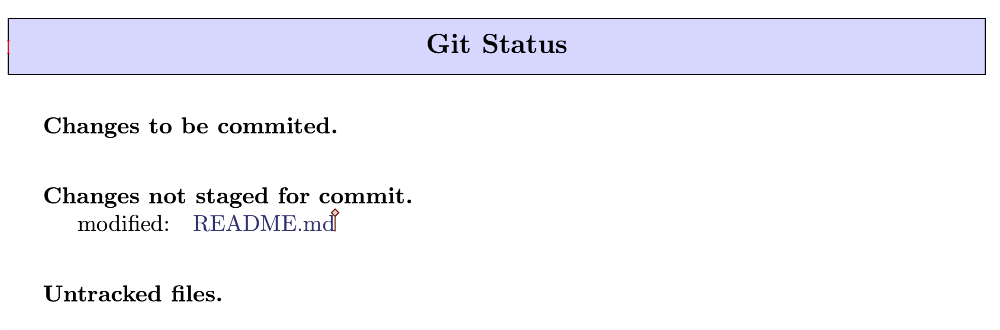
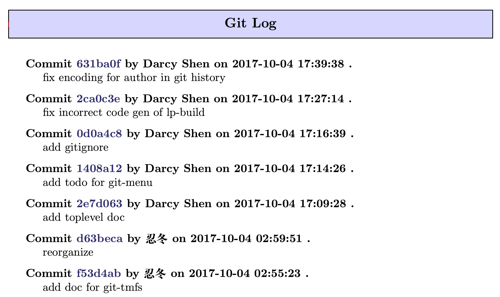
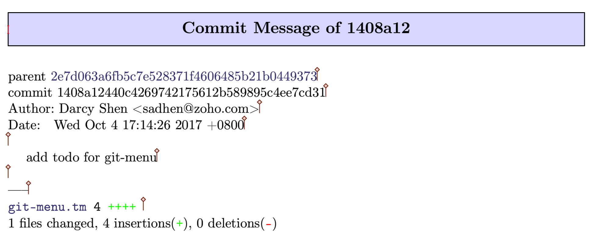
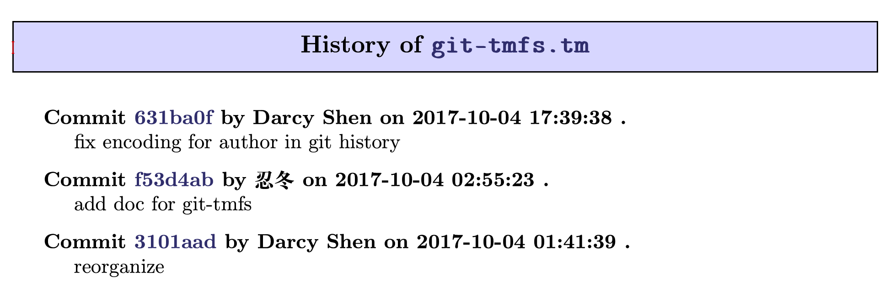

# Tigmacs: TeXmacs Git Plugin
[](https://gitter.im/texmacs/Lobby?utm_source=badge&utm_medium=badge&utm_campaign=pr-badge&utm_content=badge)


## Installation
``` bash
mkdir -p $HOME/.TeXmacs/progs/utils
git clone git@github.com:sadhen/tigmacs.git $HOME/.TeXmacs/progs/utils/git
echo "(use-modules (utils git git-menu))" >> $HOME/.TeXmacs/progs/my-init-texmacs.scm
```

## Screenshot
### git status

### git log

### git diff

### git log (current-buffer)

